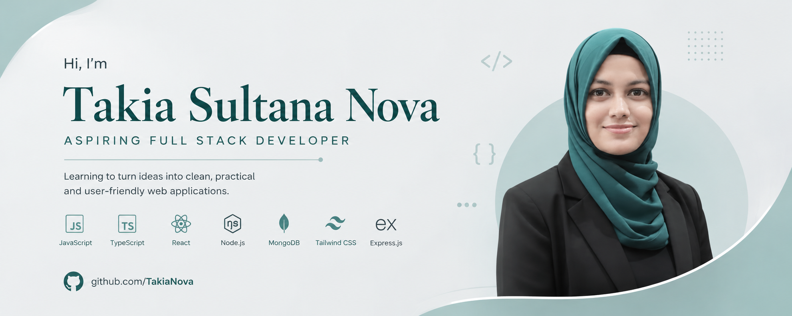
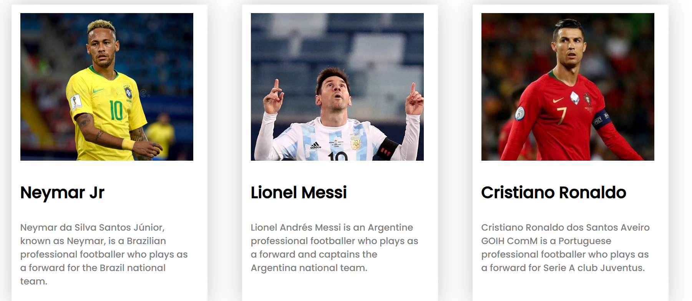
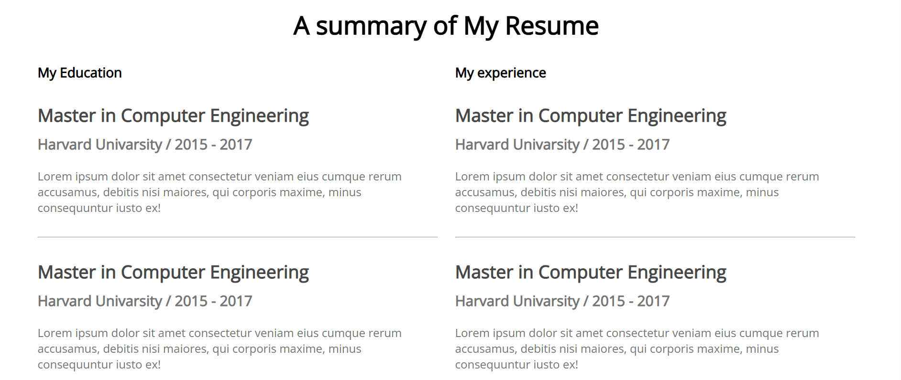

<p align="center">
  
</p>
<h1 align="center">Hi 👋, I'm Takia Sultana Nova</h1>

<h3 align="center">Aspiring Full Stack Developer | JavaScript & TypeScript Enthusiast</h3>

## 💻👨‍💻 About Me

I'm a curious and self-motivated developer who enjoys learning by building practical projects. I'm passionate about **JavaScript, TypeScript, and modern web development**, and I'm continuously working on improving my programming and problem-solving skills and trying to explore **AI-driven development**.

- 🔭 I’m currently working on **[DevConf-2026](https://github.com/TakiaNova/assignment1)**
- 🌱 I’m currently learning **TypeScript, JavaScript, React, and AI-driven development**
- 💬 Ask me about **JavaScript, TypeScript, Web Development, Git & GitHub, and Frontend Development**
- 📫 Reach me at **takiasultananova@gmail.com**
- 📄 Know more about my experience: **[My Portfolio](https://sites.google.com/view/takiasultananova/home)**
- ⚡ Fun fact: **I often start with “just one small project” and end up learning five new things.**

---

## 🛠️ Tech Stack  

### **Frontend**


### **Backend**


### **Tools & Others**


---

## 🌐 Connect With Me  

[](https://linkedin.com/in/takia-sultana)
[]([https://yourportfolio.com/](https://sites.google.com/view/takiasultananova/home))
[](mailto:takiasultananova@gmail.com)

---


<p></p>

# ⚽ Responsive Football Website

A responsive football-themed website built with HTML5 and CSS3. The project presents football players, Copa America content, match information, a sign-in interface, and responsive layouts.

## 🌐 Live Demo

👉 [View Live Website](https://takianova.github.io/responsive-football-repo/)

## 📸 Screenshot



## 🛠️ Technologies Used

- HTML5
- CSS3
- Google Fonts (Poppins)
- Font Awesome

## ✨ Main Features

- ⚽ Copa America 2021 themed hero section
- 👤 Football player profile cards
- 🖼️ Image hover transition effect
- 🏆 Match result section
- 🔐 Sign-in form interface
- 📱 Responsive layout for different screen sizes
- 🔗 Social media icons
- 🎨 Custom styling using CSS

## 📦 Dependencies

This is a static frontend project, so no npm packages or package installation are required.

External resources used:

- Google Fonts – Poppins
- Font Awesome

## 🚀 Run Locally

### 1. Clone the repository

```bash
git clone https://github.com/TakiaNova/responsive-football-repo.git


### `developer_portfolio23` — README.md

```md
# 💻 Developer Portfolio Website

A responsive developer portfolio website built with HTML5 and CSS3. The project includes sections for personal information, skills, education, experience, resume, and contact details.

## 🌐 Live Demo

👉 [View Live Website](https://takianova.github.io/developer_portfolio23/)

## 📸 Screenshot



## 🛠️ Technologies Used

- HTML5
- CSS3
- Google Fonts (Open Sans)

## ✨ Main Features

- 👋 Hero / introduction section
- 👨‍💻 About Me section
- 🛠️ Skills section
- 🎓 Education information
- 💼 Experience section
- 📄 Resume / CV section
- 📩 Contact information
- 📱 Responsive layout
- 🎨 Clean and structured portfolio design

## 📦 Dependencies

This is a static frontend project and does not require npm packages or any package installation.

External resource used:

- Google Fonts – Open Sans

## 🚀 Run Locally

### 1. Clone the repository

```bash
git clone https://github.com/TakiaNova/developer_portfolio23.git
